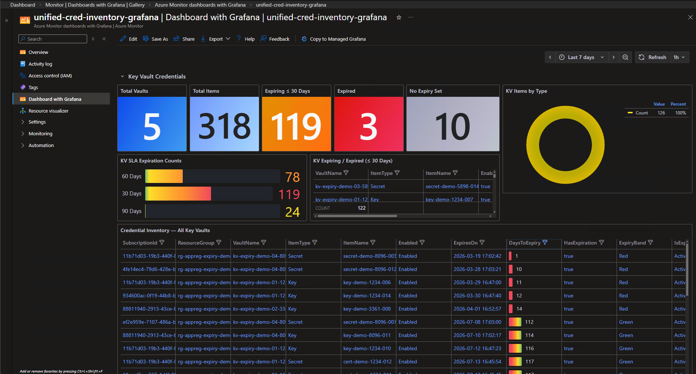

# Credential Inventory Solution — Deployment Guide

A unified monitoring solution that tracks credential expirations across **App Registrations**, **Enterprise Applications**, and **Key Vaults** in a Microsoft Entra tenant. Credential metadata is collected daily by Azure Automation Runbooks and surfaced through Grafana dashboards, Azure Portal dashboards, Azure Monitor Workbooks, and email alerts.



---

## Table of Contents

- [Solution Overview](#solution-overview)
- [Architecture](#architecture)
- [Deployed Resources](#deployed-resources)
- [How Everything Interacts](#how-everything-interacts)
- [Data Flow](#data-flow)
- [Prerequisites](#prerequisites)
- [Deployment](#deployment)
  - [Quick Start](#quick-start)
  - [Step-by-Step Walkthrough](#step-by-step-walkthrough)
  - [Parameter Reference](#parameter-reference)
- [Custom Role: Credential Inventory Reader](#custom-role-credential-inventory-reader)
- [Schemas](#schemas)
- [Dashboard Overview](#dashboard-overview)
- [Status Logic](#status-logic)
- [Creating Alert Rules and Action Groups](#creating-alert-rules-and-action-groups)
  - [Step 1 — Create an Action Group](#step-1--create-an-action-group)
  - [Step 2 — Create a Scheduled Query Alert Rule](#step-2--create-a-scheduled-query-alert-rule)
  - [Azure CLI Alternative](#azure-cli-alternative)
- [Post-Deployment Validation](#post-deployment-validation)
- [Troubleshooting](#troubleshooting)
- [Files in This Repo](#files-in-this-repo)

---

## Solution Overview

The solution collects three categories of credential metadata and writes them into Log Analytics custom tables:

| Category                          | Source API                                  | Custom Table                           | What It Tracks                                               |
| --------------------------------- | ------------------------------------------- | -------------------------------------- | ------------------------------------------------------------ |
| **App Registrations**       | Microsoft Graph `/v1.0/applications`      | `AppRegistrationCredentialExpiry_CL` | Client secrets and certificates on App Registrations         |
| **Enterprise Applications** | Microsoft Graph `/v1.0/servicePrincipals` | `AppRegistrationCredentialExpiry_CL` | Certificates on Enterprise Applications (Service Principals) |
| **Key Vaults**              | Azure Key Vault data plane                  | `KeyVaultCredentialInventory_CL`     | Certificates, keys, and secrets across all Key Vaults        |

App Registrations and Enterprise Applications share the same table and are distinguished by the `ObjectType` column (`AppRegistration` or `EnterpriseApp`). App Registrations without any credentials are also tracked (`CredentialType='None'`).

---

## Deployed Resources

The `Deploy-Solution.ps1` script creates the following resources. All resources are placed in the target resource group unless noted otherwise.

| #   | Resource                                                              | Type                                         | Purpose                                                                                                  |
| --- | --------------------------------------------------------------------- | -------------------------------------------- | -------------------------------------------------------------------------------------------------------- |
| 1   | **Resource Group**                                              | `Microsoft.Resources/resourceGroups`       | Container for all solution resources                                                                     |
| 2   | **Custom Role** (optional)                                      | `Microsoft.Authorization/roleDefinitions`  | "Credential Inventory Reader" — least-privilege role for Key Vault metadata + Logs Ingestion API writes |
| 3   | **Log Analytics Workspace**                                     | `Microsoft.OperationalInsights/workspaces` | Central data store. Can use an existing workspace or create a new one                                    |
| 4a  | **Custom Table: AppRegistrationCredentialExpiry_CL**            | Log Analytics custom table                   | Stores App Registration + Enterprise Application credential records                                      |
| 4b  | **Custom Table: KeyVaultCredentialInventory_CL**                | Log Analytics custom table                   | Stores Key Vault certificate, key, and secret records                                                    |
| 5a  | **DCR: dcr-appreg-expiry**                                      | `Microsoft.Insights/dataCollectionRules`   | Routes App Reg/Enterprise App data from Logs Ingestion API into the custom table                         |
| 5b  | **DCR: dcr-kv-inventory**                                       | `Microsoft.Insights/dataCollectionRules`   | Routes Key Vault data from Logs Ingestion API into the custom table                                      |
| 6   | **Action Group**                                                | `Microsoft.Insights/actionGroups`          | Email notification target for alerts                                                                     |
| 7a  | **Alert: App Reg expiry < 30d**                                 | `Microsoft.Insights/scheduledQueryRules`   | Fires when any App Reg/Enterprise App credential expires within 30 days                                  |
| 7b  | **Alert: KV Secret expiry < 30d**                               | `Microsoft.Insights/scheduledQueryRules`   | Fires when any Key Vault secret expires within 30 days                                                   |
| 7c  | **Alert: KV Certificate expiry < 30d**                          | `Microsoft.Insights/scheduledQueryRules`   | Fires when any Key Vault certificate expires within 30 days                                              |
| 7d  | **Alert: KV Key expiry < 30d**                                  | `Microsoft.Insights/scheduledQueryRules`   | Fires when any Key Vault key expires within 30 days                                                      |
| 8   | **Automation Account**                                          | `Microsoft.Automation/automationAccounts`  | Hosts runbook with a system-assigned managed identity                                                    |
| 9   | **Runbook: Publish-CredentialInventory**                        | Automation Runbook (PS 7.2)                  | Single merged runbook — collects App Reg, Enterprise App, and Key Vault credential data                 |
| 10  | **Schedule: DailyCredentialInventoryCollection**                | Automation Schedule                          | Triggers the runbook daily at 06:00 UTC                                                                  |
| 11a | **Workbook: App Registration Credential Expiration** (optional) | `Microsoft.Insights/workbooks`             | Interactive Azure Monitor Workbook for App Reg + Enterprise App data                                     |
| 11b | **Workbook: Key Vault Credential Inventory** (optional)         | `Microsoft.Insights/workbooks`             | Interactive Azure Monitor Workbook for Key Vault data                                                    |
| 11c | **Workbook: Unified Credential Inventory** (optional)           | `Microsoft.Insights/workbooks`             | Combined workbook with both App Reg/Enterprise App and Key Vault sections                                |
| 12a | **Portal Dashboard: App Registration**                          | `Microsoft.Portal/dashboards`              | Azure Portal shared dashboard with KQL-backed tiles                                                      |
| 12b | **Portal Dashboard: Key Vault**                                 | `Microsoft.Portal/dashboards`              | Azure Portal shared dashboard for Key Vault data                                                         |
| 12c | **Portal Dashboard: Unified**                                   | `Microsoft.Portal/dashboards`              | Combined portal dashboard with tiles from both data sources                                              |
| 13a | **Grafana Dashboard: App Reg/Enterprise App**                   | `Microsoft.Dashboard/dashboards`           | Azure Monitor Dashboards with Grafana for credential expiry                                              |
| 13b | **Grafana Dashboard: Key Vault**                                | `Microsoft.Dashboard/dashboards`           | Azure Monitor Dashboards with Grafana for Key Vault inventory                                            |
| 13c | **Grafana Dashboard: Unified**                                  | `Microsoft.Dashboard/dashboards`           | Combined Grafana dashboard across all credential types                                                   |

**RBAC assignments created automatically:**

| Assignment                                | Scope     | Purpose                                                                   |
| ----------------------------------------- | --------- | ------------------------------------------------------------------------- |
| `Monitoring Metrics Publisher`          | Both DCRs | Lets the Automation MI push data via Logs Ingestion API                   |
| `Application.Read.All` (Graph app role) | Tenant    | Lets the Automation MI read App Registration + Enterprise App credentials |

---

## How Everything Interacts

1. **Automation Account** runs a single PowerShell 7.2 runbook (`Publish-CredentialInventory`) on a daily schedule. The runbook authenticates using a **system-assigned managed identity**.
2. **App Reg & Enterprise App collection** — the runbook calls the Microsoft Graph API:

   - `/v1.0/applications` — collects secrets and certificates from **App Registrations** (tagged `ObjectType='AppRegistration'`)
   - `/v1.0/servicePrincipals` — collects certificates from **Enterprise Applications** (tagged `ObjectType='EnterpriseApp'`)
3. **Key Vault collection** — the same runbook enumerates Key Vaults across all enabled subscriptions (or a supplied list) using Azure Resource Manager, then calls the Key Vault data plane to list certificates, keys, and secret metadata (names only — no secret values). If Key Vault DCR parameters are not provided, Key Vault collection is skipped automatically.
4. The runbook serializes records as JSON and POSTs them to the **Logs Ingestion API**, targeting a **Data Collection Rule (DCR)**. The DCR applies a transform KQL and routes data into the appropriate **Log Analytics custom table**.
5. **Scheduled Query Alerts** (4 total) run once per day against the Log Analytics workspace. If any credential has fewer than 30 days remaining, the alert fires and routes to the **Action Group**, which sends email notifications.
6. **Dashboards and Workbooks** query the same Log Analytics tables using KQL:

   - **Grafana dashboards** use the Azure Monitor data source plugin and show stat cards (total App Registrations, total Enterprise Apps, expired count, etc.) plus detail tables
   - **Portal dashboards** use KQL-backed tiles pinned to an Azure Portal shared dashboard
   - **Workbooks** provide interactive filtering, summary tiles, and drill-down tables

---

## Data Flow

```
Graph API / KV API  →  Runbook  →  Logs Ingestion API  →  DCR  →  Custom Table
                                                                        │
                                              ┌─────────────────────────┤
                                              ▼                         ▼
                                        Dashboards/Workbooks    Scheduled Query Alerts
                                              (KQL)                     │
                                                                        ▼
                                                                   Action Group
                                                                        │
                                                                        ▼
                                                                  Email / Webhook
```

---

## Prerequisites

### Tools

- **Azure CLI** (`az`) — version 2.50 or later
- **PowerShell 7.2+** (for running the deployment script locally)- **powershell-yaml** module (installed automatically by the script if missing)- Azure CLI extensions (installed automatically by the script):
  - `monitor-control-service`
  - `scheduled-query`

### Permissions for the person running the deployment

| Scope                                   | Role                                       | Why                                                                                  |
| --------------------------------------- | ------------------------------------------ | ------------------------------------------------------------------------------------ |
| Target subscription or resource group   | `Contributor`                            | Create all Azure resources                                                           |
| Target subscription or resource group   | `User Access Administrator` or `Owner` | Create RBAC assignments (Monitoring Metrics Publisher on DCRs)                       |
| Microsoft Graph                         | Ability to grant app roles                 | Assign `Application.Read.All` to the Automation Account MI                         |
| Tenant root management group (optional) | `User Access Administrator`              | Create the custom RBAC role at tenant scope (only if `createRole: true` in config) |

### Network requirements

The Automation Account needs outbound HTTPS access to:

- `graph.microsoft.com` (Microsoft Graph)
- `*.ods.opinsights.azure.com` (Logs Ingestion API endpoint)
- Key Vault endpoints (`*.vault.azure.net`) for the KV runbook

---

## Deployment

### Quick Start

```powershell
# 1. Sign in
az login --tenant '<YOUR-TENANT-ID>'

# 2. Copy and edit the YAML configuration file
cp deploy-config.yaml my-deployment.yaml
# Fill in tenantId, emailAddresses, resGroup, etc.

# 3. Deploy
./scripts/Deploy-Solution.ps1 -ConfigFile './my-deployment.yaml'
```

All parameters are supplied via a single YAML configuration file. See [deploy-config.yaml](deploy-config.yaml) at the project root for a template with all defaults. The script prompts interactively for any required values left blank (Workspace, etc.).

### Step-by-Step Walkthrough

The deployment runs in 8 steps. Each step is idempotent — re-running skips resources that already exist.

#### Step 1: Resource Group

Creates the target resource group (or confirms it exists). All subsequent resources are placed here.

```
Resource Type: Microsoft.Resources/resourceGroups
```

#### Step 2: Custom Role (optional — requires `createRole: true` in config)

Creates the "Credential Inventory Reader" custom RBAC role at the tenant root management group. This role provides least-privilege access for the Key Vault runbook's management-plane and data-plane operations, plus Logs Ingestion API writes. The role definition lives in `custom-role/credential-inventory-role.json`. See the [Custom Role](#custom-role-credential-inventory-reader) section for details.

```
{
    "Name": "Credential Inventory Reader",
    "IsCustom": true,
    "Description": "Least-privilege role for the credential inventory runbooks. Reads Key Vault metadata (certs, keys, secret names - no secret values), discovers resources across subscriptions, reads Log Analytics workspaces, and publishes to Azure Monitor via the Logs Ingestion API.",
    "Actions": [
        "Microsoft.Resources/subscriptions/read",
        "Microsoft.Resources/subscriptions/resourceGroups/read",
        "Microsoft.KeyVault/vaults/read",
        "Microsoft.OperationalInsights/workspaces/read",
        "Microsoft.Insights/dataCollectionRules/read",
        "Microsoft.Insights/dataCollectionEndpoints/read"
    ],
    "NotActions": [],
    "DataActions": [
        "Microsoft.KeyVault/vaults/certificates/read",
        "Microsoft.KeyVault/vaults/keys/read",
        "Microsoft.KeyVault/vaults/secrets/readMetadata/action",
        "Microsoft.Insights/dataCollectionRules/data/write"
    ],
    "NotDataActions": [],
    "AssignableScopes": [
        "/providers/Microsoft.Management/managementGroups/477bacc4-4ada-4431-940b-b91cf6cb3fd4"
    ]
}
```

#### Step 3: Log Analytics Workspace + Custom Tables + DCRs

Creates or reuses a Log Analytics workspace, then creates:

- **Two custom tables** — `AppRegistrationCredentialExpiry_CL` and `KeyVaultCredentialInventory_CL`
- **Two Data Collection Rules** — one per table, configured as `Direct` (for the Logs Ingestion API)

If you supply `workspaceId` in the YAML config with an existing workspace resource ID, the script uses it directly. Otherwise, it prompts for a new workspace name.

```
Resource Types:
  Microsoft.OperationalInsights/workspaces
  Microsoft.Insights/dataCollectionRules
```

#### Step 4: Alerts

Creates an **Action Group** with one or more email receivers, then creates **4 scheduled query alerts**:

| Alert Name                          | Table                                  | Condition                                  |
| ----------------------------------- | -------------------------------------- | ------------------------------------------ |
| `alert-appreg-expiry-30-days`     | `AppRegistrationCredentialExpiry_CL` | Any credential with `DaysToExpiry < 30`  |
| `alert-kv-secret-expires-30-days` | `KeyVaultCredentialInventory_CL`     | Any secret with `DaysToExpiry < 30`      |
| `alert-kv-cert-expires-30-days`   | `KeyVaultCredentialInventory_CL`     | Any certificate with `DaysToExpiry < 30` |
| `alert-kv-key-expires-30-days`    | `KeyVaultCredentialInventory_CL`     | Any key with `DaysToExpiry < 30`         |

All alerts: evaluation frequency = 24 hours, window size = 24 hours, severity = 2, auto-mitigate = false.

```
Resource Types:
  Microsoft.Insights/actionGroups
  Microsoft.Insights/scheduledQueryRules
```

#### Step 5: Automation Account + Runbooks + Schedules

Creates an Automation Account with a **system-assigned managed identity**, then:

1. **Publishes one merged runbook** (PowerShell 7.2):

   - `Publish-CredentialInventory` — collects App Reg + Enterprise App credentials and Key Vault cert/key/secret metadata in a single run
2. **Grants RBAC** to the managed identity:

   - `Monitoring Metrics Publisher` on both DCRs
   - `Application.Read.All` Microsoft Graph app role
3. **Creates one daily schedule** (`DailyCredentialInventoryCollection`, 06:00 UTC) linked to the runbook with both AppReg and Key Vault DCR endpoints/immutable IDs as parameters.

```
Resource Types:
  Microsoft.Automation/automationAccounts
  Microsoft.Automation/automationAccounts/runbooks
  Microsoft.Automation/automationAccounts/schedules
  Microsoft.Automation/automationAccounts/jobSchedules
  Microsoft.Authorization/roleAssignments
```

#### Step 6: Workbooks (optional — requires `createWorkbooks: true` in config)

Deploys three Azure Monitor Workbooks:

- **App Registration Credential Expiration** — parameters, SLA counts, credential type breakdown, pie chart, expiring detail table with ExpiryBand colors
- **Key Vault Credential Inventory** — summary tiles, SLA expiration counts table, detail table
- **Unified Credential Inventory** — combined workbook with section headers for both App Reg/Enterprise App and Key Vault data

```
Resource Type: Microsoft.Insights/workbooks
```

#### Step 7: Azure Portal Dashboards

Deploys three shared Azure Portal dashboards with KQL-backed tiles:

- **App Registration dashboard** — stat tiles + expiring/expired table + full credential status table
- **Key Vault dashboard** — similar layout for KV data
- **Unified Credential Inventory dashboard** — all tiles from both sources in a single dashboard

Template placeholders (`__WORKSPACE_RESOURCE_ID__`, etc.) are replaced with actual values at deploy time.

```
Resource Type: Microsoft.Portal/dashboards
```

#### Step 8: Azure Monitor Dashboards with Grafana

Deploys three Grafana dashboards using the Azure Monitor Dashboards resource type:

- **App Reg / Enterprise App credential expiry** — stat cards, pie chart, bar gauge, detail table
- **Key Vault credential inventory** — similar layout
- **Unified credential inventory** — combined panels from both sources

These use the `Microsoft.Dashboard/dashboards` resource type with the `GrafanaDashboardResourceType: Azure Monitor` tag.

```
Resource Type: Microsoft.Dashboard/dashboards
```

### Parameter Reference

`Deploy-Solution.ps1` accepts a single parameter:

| Parameter       | Required      | Description                         |
| --------------- | ------------- | ----------------------------------- |
| `-ConfigFile` | **Yes** | Path to the YAML configuration file |

All deployment values are specified in the YAML file. See [deploy-config.yaml](deploy-config.yaml) for the complete template.

#### YAML Configuration Keys

| Key                        | Required | Default                                | Description                                     |
| -------------------------- | -------- | -------------------------------------- | ----------------------------------------------- |
| `tenantId`               | Yes*     | (blank)                                | Azure AD tenant ID                              |
| `emailAddresses`         | Yes*     | (blank)                                | List of email addresses for alert notifications |
| `resGroup`               | Yes*     | (blank)                                | Target resource group name                      |
| `workspaceId`            | No       | (blank — prompts or creates new)      | Existing Log Analytics workspace resource ID    |
| `automationAccountId`    | No       | (blank — creates new)                 | Existing Automation Account resource ID         |
| `location`               | No       | `centralus`                          | Azure region for all resources                  |
| `tags`                   | No       | `{}`                                 | Key/value pairs applied to all resources        |
| `createRole`             | No       | `false`                              | Create the custom RBAC role at tenant scope     |
| `createWorkbooks`        | No       | `false`                              | Deploy Azure Monitor Workbooks                  |
| `appRegTableName`        | No       | `AppRegistrationCredentialExpiry_CL` | Override the App Reg table name                 |
| `appRegDcrName`          | No       | `dcr-appreg-expiry`                  | Override the App Reg DCR name                   |
| `kvTableName`            | No       | `KeyVaultCredentialInventory_CL`     | Override the KV table name                      |
| `kvDcrName`              | No       | `dcr-kv-inventory`                   | Override the KV DCR name                        |
| `actionGroupName`        | No       | `ag-credential-inventory`            | Override the Action Group name                  |
| `automationAccountName`  | No       | `aa-credential-inventory`            | Name for new Automation Account                 |
| `portalDashboardName`    | No       | `credential-inventory-dashboard`     | Azure Portal dashboard name                     |
| `grafanaAppRegDashName`  | No       | `appreg-cred-expiry-grafana`         | Grafana dashboard name (App Reg)                |
| `grafanaKvDashName`      | No       | `kv-cred-inventory-grafana`          | Grafana dashboard name (KV)                     |
| `grafanaUnifiedDashName` | No       | `unified-cred-inventory-grafana`     | Grafana dashboard name (Unified)                |

*Prompted interactively if left blank in the YAML file.

---

## Custom Role: Credential Inventory Reader

A custom RBAC role scoped at the tenant root management group providing least-privilege access for the runbooks.

### Management plane (Actions)

| Permission                                                | Purpose                                         |  |
| --------------------------------------------------------- | ----------------------------------------------- | - |
| `Microsoft.Resources/subscriptions/read`                | Enumerate subscriptions for Key Vault discovery |  |
| `Microsoft.Resources/subscriptions/resourceGroups/read` | List resource groups                            |  |
| `Microsoft.KeyVault/vaults/read`                        | Discover Key Vaults                             |  |
| `Microsoft.OperationalInsights/workspaces/read`         | Read the Log Analytics workspace                |  |
| `Microsoft.Insights/dataCollectionRules/read`           | Read DCR configuration                          |  |
| `Microsoft.Insights/dataCollectionEndpoints/read`       | Read Data Collection Endpoint configuration     |  |

### Data plane (DataActions)

| Permission                                                | Purpose                                                               |  |
| --------------------------------------------------------- | --------------------------------------------------------------------- | - |
| `Microsoft.KeyVault/vaults/certificates/read`           | List and read certificate metadata                                    |  |
| `Microsoft.KeyVault/vaults/keys/read`                   | List and read key metadata                                            |  |
| `Microsoft.KeyVault/vaults/secrets/readMetadata/action` | List and read secret names only —**cannot** read secret values |  |
| `Microsoft.Insights/dataCollectionRules/data/write`     | Publish data through the Logs Ingestion API                           |  |

> **Note:** App Registration and Enterprise Application credential access requires the `Application.Read.All` Microsoft Graph app role, which is granted separately via the Graph API — not Azure RBAC.

### Create and assign the role

The custom role definition and deployment script live in the `custom-role/` folder:

```powershell
# 1. Update the role JSON with your tenant ID (if AssignableScopes has a placeholder)
# 2. Create or update the role
./custom-role/New-CredentialInventoryRole.ps1

# 3. Assign to the Automation Account managed identity
az role assignment create `
    --assignee-object-id '<MANAGED_IDENTITY_OBJECT_ID>' `
    --assignee-principal-type ServicePrincipal `
    --role 'Credential Inventory Reader' `
    --scope '/providers/Microsoft.Management/managementGroups/<YOUR-TENANT-ID>'
```

---

## Schemas

### AppRegistrationCredentialExpiry_CL

| Column                     | Type     | Description                                                              |
| -------------------------- | -------- | ------------------------------------------------------------------------ |
| `TimeGenerated`          | datetime | Collection timestamp                                                     |
| `TenantId`               | string   | Azure AD tenant ID                                                       |
| `ApplicationObjectId`    | string   | Object ID of the App Registration or Service Principal                   |
| `ApplicationId`          | string   | Application (client) ID                                                  |
| `ApplicationDisplayName` | string   | Display name                                                             |
| `CredentialType`         | string   | `Secret`, `Certificate`, or `None`                                 |
| `CredentialDisplayName`  | string   | Friendly name of the credential                                          |
| `CredentialKeyId`        | string   | Unique key identifier                                                    |
| `StartDateUtc`           | datetime | Credential start date                                                    |
| `EndDateUtc`             | datetime | Credential expiration date                                               |
| `DaysToExpiry`           | int      | Days until expiration (`-1` for no credentials)                        |
| `ExpiryBand`             | string   | `Green`, `Yellow`, `Red`, or `NoCredential`                      |
| `ExpiryColor`            | string   | Same as ExpiryBand (used for visual mapping)                             |
| `IsExpired`              | bool     | True if DaysToExpiry < 0                                                 |
| `CollectionRunId`        | string   | GUID identifying the collection run                                      |
| `Collector`              | string   | Identifies the collector source (e.g.,`Runbook-AppRegistrationExpiry`) |
| `ObjectType`             | string   | `AppRegistration` or `EnterpriseApp`                                 |

### KeyVaultCredentialInventory_CL

| Column              | Type     | Description                                         |
| ------------------- | -------- | --------------------------------------------------- |
| `TimeGenerated`   | datetime | Collection timestamp                                |
| `TenantId`        | string   | Azure AD tenant ID                                  |
| `SubscriptionId`  | string   | Subscription containing the Key Vault               |
| `ResourceGroup`   | string   | Resource group containing the Key Vault             |
| `VaultName`       | string   | Key Vault name                                      |
| `ItemType`        | string   | `Certificate`, `Key`, or `Secret`             |
| `ItemName`        | string   | Name of the item                                    |
| `Enabled`         | bool     | Whether the item is enabled                         |
| `CreatedOn`       | datetime | Creation date                                       |
| `ExpiresOn`       | datetime | Expiration date                                     |
| `NotBefore`       | datetime | Not valid before date                               |
| `DaysToExpiry`    | int      | Days until expiration                               |
| `HasExpiration`   | bool     | Whether the item has an expiration set              |
| `ExpiryBand`      | string   | `Green`, `Yellow`, `Red`, or `NoExpiration` |
| `IsExpired`       | bool     | True if DaysToExpiry < 0                            |
| `CollectionRunId` | string   | GUID identifying the collection run                 |
| `Collector`       | string   | Identifies the collector source                     |

---

## Dashboard Overview

### Grafana — App Registration & Enterprise App Credential Expiry

| Panel                                                 | Description                                                               |
| ----------------------------------------------------- | ------------------------------------------------------------------------- |
| **App Registrations** (stat)                    | Total distinct App Registrations in the latest collection                 |
| **Enterprise Apps** (stat)                      | Total distinct Enterprise Applications in the latest collection           |
| **Without Credentials** (stat)                  | App Registrations with no secrets or certificates                         |
| **Expiring ≤ 30 Days** (stat)                  | Credentials expiring within 30 days                                       |
| **Expired** (stat)                              | Credentials already expired                                               |
| **Expiry Band Distribution** (pie chart)        | Breakdown by Green/Yellow/Red/NoCredential                                |
| **SLA Expiration Counts** (bar gauge)           | Grouped counts by expiry band                                             |
| **Credential Status — All Identities** (table) | Full detail table with ObjectType, Application, Credential, Dates, Status |

### Grafana — Key Vault Credential Inventory

Similar layout with stat cards for total vaults, total items, without expiration, expiring, and expired.

### Azure Portal Dashboards

KQL-backed tiles with the same metrics, rendered natively in the Azure Portal.

### Azure Monitor Workbooks

Interactive reports with summary tiles and detail grids. Support filtering and drill-down.

---

## Status Logic

Each credential record is assigned an expiry band:

| Band             | Condition                           | Color         |
| ---------------- | ----------------------------------- | ------------- |
| `Green`        | More than 90 days remaining         | Green         |
| `Yellow`       | 30–90 days remaining               | Yellow/Orange |
| `Red`          | Fewer than 30 days remaining        | Red           |
| `NoCredential` | App Registration has no credentials | Gray          |

App Registrations with **no credentials** are emitted with `CredentialType='None'`, `DaysToExpiry=-1`, and `ExpiryBand='NoCredential'`. These appear in total counts and "Without Credentials" panels but are excluded from expiry alerts.

---

## Creating Alert Rules and Action Groups

The `Deploy-Solution.ps1` script creates 4 scheduled query alerts and an Action Group automatically. Use the steps below to create additional alerts manually or to recreate them if needed.

### Step 1 — Create an Action Group

An Action Group defines **who gets notified** when an alert fires. Create one before creating alert rules.

1. Navigate to **Monitor** > **Alerts** in the Azure Portal.
2. Click **Action groups** in the top menu bar.
3. Click **+ Create**.
4. On the **Basics** tab:
   - **Subscription**: Select the subscription containing your resource group.
   - **Resource group**: Select your credential inventory resource group (e.g., `rg-credential-inventory`).
   - **Action group name**: Enter a name (e.g., `ag-credential-inventory`).
   - **Display name**: Enter a short display name (e.g., `CredInv`).
5. On the **Notifications** tab:
   - **Notification type**: Select **Email/SMS message/Push/Voice**.
   - **Name**: Enter a name for the notification (e.g., `SecurityTeamEmail`).
   - In the detail pane, check **Email** and enter the recipient email address.
   - Click **OK**.
   - Repeat to add additional recipients.
6. (Optional) On the **Actions** tab, add webhook, Azure Function, Logic App, or other action types.
7. On the **Tags** tab, add tags if desired.
8. Click **Review + create**, then **Create**.

> **Tip:** You can add multiple notification types (email, SMS, push) and multiple action types (webhook, ITSM, runbook) to a single Action Group.

### Step 2 — Create a Scheduled Query Alert Rule

A Scheduled Query Alert Rule runs a KQL query on a schedule and fires when the results meet a condition.

1. Navigate to **Monitor** > **Alerts** in the Azure Portal.
2. Click **+ Create** > **Alert rule**.
3. On the **Scope** tab:
   - Click **Select scope**.
   - Search for and select your **Log Analytics workspace** (e.g., `msft-core-cus-law`).
   - Click **Apply**.
4. On the **Condition** tab:
   - **Signal name**: Select **Custom log search**.
   - **Search query**: Enter the KQL query. For example, to alert on App Registration credentials expiring within 30 days:

     ```kql
     AppRegistrationCredentialExpiry_CL
     | summarize arg_max(TimeGenerated, *) by ApplicationId, CredentialKeyId
     | where CredentialType != 'None' and DaysToExpiry < 30
     | count
     ```

     Other example queries for Key Vault alerts:

     ```kql
     // Key Vault secrets expiring within 30 days
     KeyVaultCredentialInventory_CL
     | summarize arg_max(TimeGenerated, *) by VaultName, ItemType, ItemName
     | where ItemType == 'Secret' and HasExpiration == true and DaysToExpiry < 30
     | count
     ```

     ```kql
     // Key Vault certificates expiring within 30 days
     KeyVaultCredentialInventory_CL
     | summarize arg_max(TimeGenerated, *) by VaultName, ItemType, ItemName
     | where ItemType == 'Certificate' and HasExpiration == true and DaysToExpiry < 30
     | count
     ```

     ```kql
     // Key Vault keys expiring within 30 days
     KeyVaultCredentialInventory_CL
     | summarize arg_max(TimeGenerated, *) by VaultName, ItemType, ItemName
     | where ItemType == 'Key' and HasExpiration == true and DaysToExpiry < 30
     | count
     ```
   - **Measurement**: Set **Measure** to `Table rows` and **Aggregation type** to `Count`.
   - **Alert logic**: Set **Operator** to `Greater than` and **Threshold value** to `0`.
   - **Evaluation**: Set **Evaluation period (window size)** to `1 day (24 hours)` and **Frequency of evaluation** to `1 day (24 hours)`.
5. On the **Actions** tab:
   - Click **Select action groups**.
   - Select the Action Group you created in Step 1.
   - Click **Select**.
6. On the **Details** tab:
   - **Subscription**: Confirm the correct subscription.
   - **Resource group**: Select the resource group for the alert rule.
   - **Severity**: Select `2 - Warning` (or adjust per your requirements).
   - **Alert rule name**: Enter a descriptive name (e.g., `alert-appreg-expiry-30-days`).
   - **Alert rule description**: Enter a description (e.g., `App registration secret or certificate expires within 30 days.`).
   - Uncheck **Automatically resolve alerts** (auto-mitigate) — credentials remain expired until rotated.
7. On the **Tags** tab, add tags if desired.
8. Click **Review + create**, then **Create**.

Repeat Steps 2–8 for each additional alert rule (KV secrets, KV certificates, KV keys).

### Alerts Deployed by the Script

For reference, the deployment script creates these 4 alert rules:

| Alert Rule Name                     | Target Table                           | Filter                                                                        | Description                                                  |
| ----------------------------------- | -------------------------------------- | ----------------------------------------------------------------------------- | ------------------------------------------------------------ |
| `alert-appreg-expiry-30-days`     | `AppRegistrationCredentialExpiry_CL` | `CredentialType != 'None' and DaysToExpiry < 30`                            | Any App Reg/Enterprise App credential expires within 30 days |
| `alert-kv-secret-expires-30-days` | `KeyVaultCredentialInventory_CL`     | `ItemType == 'Secret' and HasExpiration == true and DaysToExpiry < 30`      | Any Key Vault secret expires within 30 days                  |
| `alert-kv-cert-expires-30-days`   | `KeyVaultCredentialInventory_CL`     | `ItemType == 'Certificate' and HasExpiration == true and DaysToExpiry < 30` | Any Key Vault certificate expires within 30 days             |
| `alert-kv-key-expires-30-days`    | `KeyVaultCredentialInventory_CL`     | `ItemType == 'Key' and HasExpiration == true and DaysToExpiry < 30`         | Any Key Vault key expires within 30 days                     |

All alerts: Severity = 2, Evaluation frequency = 24h, Window size = 24h, Auto-mitigate = false.

### Azure CLI Alternative

You can create the Action Group and alert rules from the command line:

```powershell
# 1. Create the Action Group
az monitor action-group create `
    --name 'ag-credential-inventory' `
    --resource-group 'rg-credential-inventory' `
    --short-name 'CredInv' `
    --action email SecurityTeam security-team@contoso.com

# 2. Get the Action Group resource ID
$agId = az monitor action-group show `
    --name 'ag-credential-inventory' `
    --resource-group 'rg-credential-inventory' `
    --query id -o tsv

# 3. Get the Workspace resource ID
$wsId = az monitor log-analytics workspace show `
    --resource-group 'msft-core-observability' `
    --workspace-name 'msft-core-cus-law' `
    --query id -o tsv

# 4. Create a scheduled query alert rule
az monitor scheduled-query create `
    --name 'alert-appreg-expiry-30-days' `
    --resource-group 'rg-credential-inventory' `
    --scopes $wsId `
    --condition "count 'GreaterThan' 0" `
    --condition-query "AppRegistrationCredentialExpiry_CL | summarize arg_max(TimeGenerated, *) by ApplicationId, CredentialKeyId | where CredentialType != 'None' and DaysToExpiry < 30 | count" `
    --description 'App registration secret or certificate expires within 30 days.' `
    --evaluation-frequency '24h' `
    --window-size '24h' `
    --severity 2 `
    --action-groups $agId `
    --auto-mitigate false
```

Repeat the `az monitor scheduled-query create` command for each additional alert, substituting the appropriate query and name.

---

## Post-Deployment Validation

1. **Trigger the first collection run:**

   - Navigate to the Automation Account in the portal
   - Open **Runbooks** > `Publish-CredentialInventory` > **Start**
   - Or wait until the next 06:00 UTC scheduled run
2. **Verify data ingestion:**

   ```kql
   AppRegistrationCredentialExpiry_CL
   | take 10
   ```

   ```kql
   KeyVaultCredentialInventory_CL
   | take 10
   ```

   > Note: New custom tables can take up to 15 minutes before data appears after the first ingestion.
   >
3. **Verify ObjectType column:**

   ```kql
   AppRegistrationCredentialExpiry_CL
   | summarize count() by ObjectType
   ```

   You should see rows for both `AppRegistration` and `EnterpriseApp`.
4. **Verify alerts:**

   - Navigate to **Monitor** > **Alerts** and confirm the 4 scheduled query rules exist
   - If credentials expiring within 30 days exist, an alert should fire within 24 hours
5. **Verify dashboards:**

   - **Grafana:** Navigate to the resource group and open the 3 Grafana dashboard resources (AppReg, KV, Unified)
   - **Portal:** Navigate to **Dashboard** in the Azure Portal and find the 3 shared dashboards
   - **Workbooks:** Navigate to **Monitor** > **Workbooks** (if deployed with `createWorkbooks: true` in config)

---

## Troubleshooting

### Collector gets `403` from Microsoft Graph

The Automation Account managed identity needs the `Application.Read.All` Graph app role. Verify:

```powershell
$miObjectId = '<MANAGED-IDENTITY-OBJECT-ID>'
az rest --method GET `
    --uri "https://graph.microsoft.com/v1.0/servicePrincipals/$miObjectId/appRoleAssignments" `
    --query "value[?appRoleId=='9a5d68dd-52b0-4cc2-bd40-abcf44ac3a30']"
```

If empty, re-run the Graph app role assignment (done automatically by the deployment script).

### Collector gets `403` from the Logs Ingestion API

Verify `Monitoring Metrics Publisher` is assigned on the DCR:

```powershell
az role assignment list --scope '<DCR-RESOURCE-ID>' --assignee '<MI-OBJECT-ID>'
```

Also verify the DCR immutable ID and ingestion endpoint match what's configured in the runbook schedule parameters.

### Key Vault runbook gets `403` on specific vaults

Key Vaults using the **vault access policy** model require explicit access policies for the managed identity. The custom role RBAC works only on vaults using the **Azure RBAC** authorization model. For access-policy vaults, add a policy granting: certificates (List), keys (List), secrets (List).

### No data in the table after first run

- Custom tables can take up to 15 minutes after creation before data appears.
- Check the runbook job output in the Automation Account for errors.
- Verify the DCR transform KQL is valid — the deployment script configures this automatically.

### Dashboard shows stale data

Dashboards query the latest collection run using `arg_max(TimeGenerated, *)`. If the runbook schedule is paused or failing, data becomes stale. Check Automation Account job history.

### Enterprise Apps column shows blank ObjectType

Older data collected before the Enterprise App feature was added will not have an `ObjectType` value. All KQL queries include backward-compatible logic: `extend ObjectType = iff(isempty(ObjectType), 'AppRegistration', ObjectType)`.

---

## Files in This Repo

### Configuration

| File                   | Purpose                                                           |
| ---------------------- | ----------------------------------------------------------------- |
| `deploy-config.yaml` | YAML configuration template — copy and fill in before deployment |

### Scripts

| File                                          | Purpose                                                                                                           |
| --------------------------------------------- | ----------------------------------------------------------------------------------------------------------------- |
| `scripts/Deploy-Solution.ps1`               | **Primary customer deployment script** — reads `deploy-config.yaml` and deploys all resources end-to-end |
| `scripts/Publish-AppRegistrationExpiry.ps1` | Local/ad-hoc collector for App Reg + Enterprise App data (uses `az` CLI auth)                                   |

### Custom Role

| File                                            | Purpose                                                          |
| ----------------------------------------------- | ---------------------------------------------------------------- |
| `custom-role/credential-inventory-role.json`  | Custom role definition (Credential Inventory Reader)             |
| `custom-role/New-CredentialInventoryRole.ps1` | Creates or updates the custom RBAC role from the JSON definition |

### Runbooks

| File                                         | Purpose                                                                                                                                                                |
| -------------------------------------------- | ---------------------------------------------------------------------------------------------------------------------------------------------------------------------- |
| `runbooks/Publish-CredentialInventory.ps1` | Automation Runbook — single merged runbook that collects App Reg, Enterprise App, and Key Vault credential data. Auto-discovers subscriptions when none are provided. |

### Azure Portal Dashboards

| File                                                                     | Purpose                                                         |
| ------------------------------------------------------------------------ | --------------------------------------------------------------- |
| `monitor-azure-dashboards/azure-portal-dashboard.json`                 | Azure Portal shared dashboard for App Reg + Enterprise App data |
| `monitor-azure-dashboards/keyvault-portal-dashboard.json`              | Azure Portal shared dashboard for Key Vault data                |
| `monitor-azure-dashboards/unified-credential-inventory-dashboard.json` | Combined portal dashboard with tiles from both data sources     |

### Grafana Dashboards

| File                                                                     | Purpose                                                          |
| ------------------------------------------------------------------------ | ---------------------------------------------------------------- |
| `monitor-grafana-dashboards/grafana-appreg-expiry.json`                | Grafana dashboard for App Reg + Enterprise App credential expiry |
| `monitor-grafana-dashboards/grafana-keyvault-inventory.json`           | Grafana dashboard for Key Vault credential inventory             |
| `monitor-grafana-dashboards/grafana-unified-credential-inventory.json` | Combined Grafana dashboard across all credential types           |

### Workbooks

| File                                                              | Purpose                                                                   |
| ----------------------------------------------------------------- | ------------------------------------------------------------------------- |
| `monitor-workbooks/app-registration-expiration.workbook.json`   | Azure Monitor Workbook for App Reg + Enterprise App credential expiration |
| `monitor-workbooks/keyvault-credential-inventory.workbook.json` | Azure Monitor Workbook for Key Vault credential inventory                 |
| `monitor-workbooks/unified-credential-inventory.workbook.json`  | Combined workbook with sections for both data sources                     |

### Queries

The `queries/` folder contains 38 KQL query files organized by prefix:

| Prefix         | Count | Description                                                                                                                          |
| -------------- | ----- | ------------------------------------------------------------------------------------------------------------------------------------ |
| `appreg-*`   | 14    | App Registration + Enterprise App queries (summary, expiring, expired, SLA, breakdown, etc.)                                         |
| `keyvault-*` | 16    | Key Vault queries (summary, items by type/subscription/vault, disabled, alerts, etc.)                                                |
| `combined-*` | 3     | Cross-table queries (executive summary, collection health, combined expiring)                                                        |
| Alert queries  | 4     | `expiring-credentials-alert.kql`, `keyvault-certificates-alert.kql`, `keyvault-keys-alert.kql`, `keyvault-secrets-alert.kql` |
| Other          | 1     | `app-registration-expiration.kql` (main overview query)                                                                            |

See [queries/README.md](queries/README.md) for a full listing with descriptions.

---

## References

- [Azure Monitor Alerts Overview](https://learn.microsoft.com/en-us/azure/azure-monitor/alerts/alerts-overview)
- [Azure Workbooks Overview](https://learn.microsoft.com/en-us/azure/azure-monitor/visualize/workbooks-overview)
- [Logs Ingestion API in Azure Monitor](https://learn.microsoft.com/en-us/azure/azure-monitor/logs/logs-ingestion-api-overview)
- [Tutorial: Send Data to Azure Monitor Logs](https://learn.microsoft.com/en-us/azure/azure-monitor/logs/tutorial-logs-ingestion-portal)
- [Microsoft Graph Permissions Reference](https://learn.microsoft.com/en-us/graph/permissions-reference)
- [Key Vault RBAC Guide](https://learn.microsoft.com/en-us/azure/key-vault/general/rbac-guide)
- [Azure Custom Roles](https://learn.microsoft.com/en-us/azure/role-based-access-control/custom-roles)
- [Manage Access to Log Analytics Workspaces](https://learn.microsoft.com/en-us/azure/azure-monitor/logs/manage-access)
